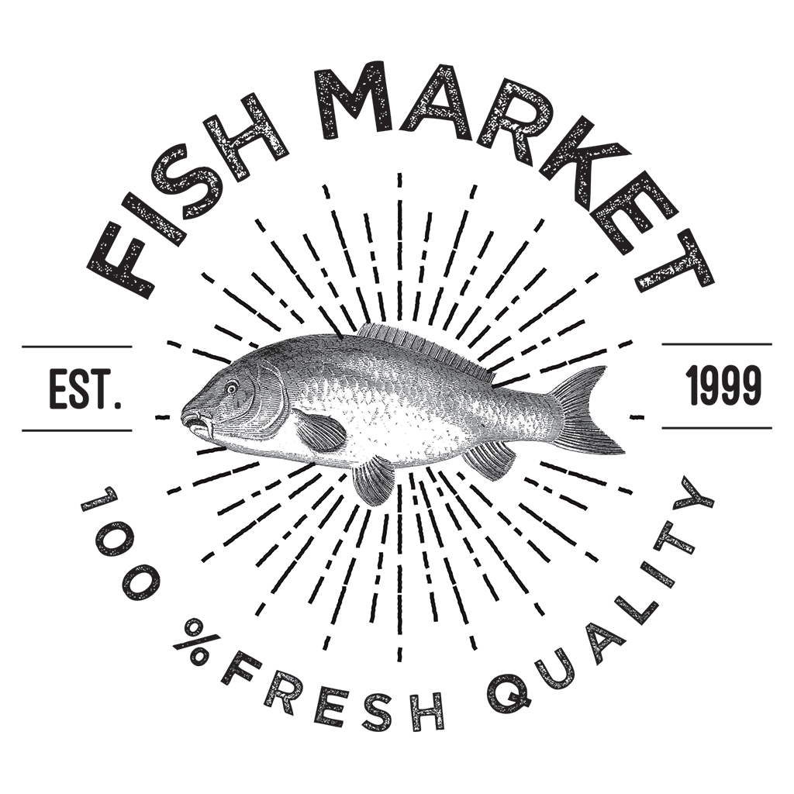

# What is this shenaniganry?

Oh hey! This is my (Constance, the person who is narrating) personal boilerplate for starting quick sites like landing pages or other front-ends (becuase there clearly aren't enough frameworks out there on the internet). It's meant to be fairly simple and reusable, but above all individual. But feel free to fork or what have you!

## But why "sea-bass"?

I dunno, it was some god-awful pun I came up with in the middle of the night after eating too much pizza. Here was my thought process:

- My first and last name starts with "C"
- This is a "base" framework of sorts
- C-Base is probably already taken
- Oh wait! I love vintage hipster logos

Thus... sea bass(?)

## Where else has this tomfoolery proliferated?

Huh, let's see, I know have variations of this somewhere!

- [My portfolio site (I would hope so anyway)](https://www.constancechen.me)
- [Seattle Indies](https://www.seattleindies.org)
- ...and more to come!

## Usage

- Download or clone
- `npm install`
- `gulp`
